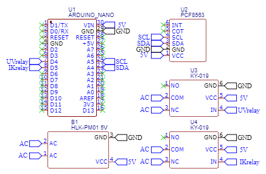

# turtleController

## Setting

Set relay ports if using different
    #define UVrelay 4
    #define IKrelay 5

Set your date, time and week
    #define date 10,12,22
    #define time 14,45,00
    #define week 6 # 1- Monday, 2 - Tuesday, etc.

Set working period
    #define uvOnHour 8
    #define uvOffHour 14
    #define ikOnHour 8
    #define ikOffHour 23

Set <code>true</code> to rewrite time
    bool isSetTime = false;
    
## List of components

| id |       name      | pcs |
|:--:|:---------------:|:---:|
| 1  | Arduino Nano v3 | 1   |
| 2  | PCF8563         | 1   |
| 3  | KY-019          | 2   |
| 4  | Power unit 5V   | 1   |

## Scheme

